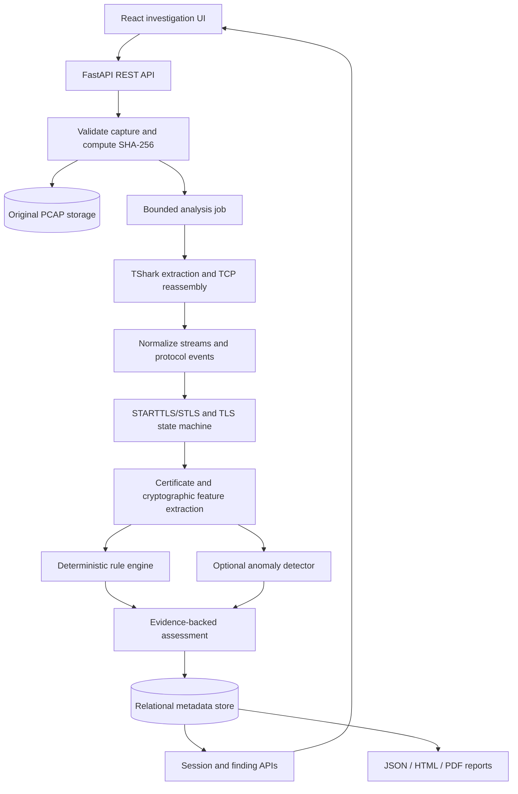

# SecureMailScope — Technical Architecture

**Version:** 1.0 proposed | **Principle:** modular monolith, local-first, evidence-first.

## 1. Stack
| Layer | Choice | Rationale |
|---|---|---|
| Web | React + TypeScript + Vite | Typed fast SPA |
| UI | Tailwind CSS, shadcn/ui, Lucide | Accessible dashboard primitives |
| Animation | Motion; selective React Bits | Controlled, reduced-motion-aware interactions |
| Charts | Recharts; optional Bklit after license/API verification | Avoid duplicate chart stacks initially |
| API | Python, FastAPI, Pydantic | Typed ingestion and analysis APIs |
| Packet parsing | TShark CLI, pinned version | Mature protocol dissection and TCP reassembly |
| Crypto | Python `cryptography` | X.509 and cryptographic property inspection |
| Storage | SQLite in development; PostgreSQL migration path | Simple first deployment |
| Jobs | In-process bounded worker for prototype; RQ/Redis later | Nonblocking capture analysis |
| ML | pandas, NumPy, scikit-learn Isolation Forest | Explainable baseline anomaly workflow |
| Reports | Jinja2 HTML, ReportLab PDF, JSON | Consistent exports |
| Lab | Docker Compose, Postfix, Dovecot, OpenSSL, tcpdump | Repeatable authorized captures |
| Tests | pytest, Vitest, Playwright | Unit, integration, E2E |

## 2. Logical data flow


## 3. Modules and contracts
- `capture_service`: MIME-independent magic-byte validation for PCAP/PCAPNG, size caps, content hash, immutable originals, temporary staging and cleanup.
- `tshark_adapter`: explicit executable discovery/version check, argument-array subprocess, timeouts, output-size limits, error capture; avoid invoking through shell.
- `stream_service`: map `tcp.stream` to ordered packet references; detect gaps, retransmissions, out-of-order packets and truncated capture; never claim a full original session if capture incomplete.
- `protocol_detector`: protocol dissector output plus command signatures and standard ports as supporting hints; explicit unknown state.
- `upgrade_parser`: per-protocol SMTP STARTTLS, IMAP STARTTLS, POP3 STLS state machines with server response, TLS start, success/failure and incomplete states.
- `tls_parser`: ClientHello/ServerHello, selected cipher, protocol version, alerts, visible certificates and handshake completeness; distinguish offered versus negotiated versions and ciphers.
- `certificate_service`: parse only available certificate bytes; expiry relative to captured timestamp and current assessment date as separate checks; trust chain validation only with documented trust anchors and intermediates; TLS 1.3 passive visibility limits.
- `rule_engine`: versioned deterministic rules with rule ID, severity, observation, applicability, confidence, evidence and remediation.
- `ml_service`: offline training/evaluation, model artifact versioning and advisory anomaly outputs; never overwrite deterministic findings.
- `report_service`: one canonical assessment schema rendered to JSON, HTML and PDF.

## 4. Data model
- `investigations(id, title, created_at, status)`
- `captures(id, investigation_id, filename, sha256, bytes, format, stored_path, uploaded_at, tshark_version)`
- `analysis_jobs(id, capture_id, state, started_at, ended_at, error_code, parser_version)`
- `sessions(id, capture_id, tcp_stream, src, dst, src_port, dst_port, protocol, completeness, started_at, ended_at)`
- `events(id, session_id, packet_number, event_type, timestamp, observed_json)`
- `tls_handshakes(id, session_id, version, cipher, outcome, completeness, evidence_json)`
- `certificates(id, handshake_id, fingerprint, subject, issuer, not_before, not_after, public_key, signature_algorithm, validation_json)`
- `findings(id, session_id, rule_id, severity, confidence, title, explanation, evidence_json, remediation, rule_version)`
- `ml_assessments(id, session_id, model_version, anomaly_score, feature_json, explanation_json)`
- `reports(id, investigation_id, format, created_at, path, assessment_version)`

Use SQLAlchemy and Alembic from the beginning. Never persist uploaded secrets in logs. `evidence_json` includes capture hash, stream and packet numbers.

## 5. API v1
- `GET /api/v1/health` — runtime health and TShark availability (no sensitive paths publicly exposed).
- `POST /api/v1/investigations` — create case.
- `GET /api/v1/investigations` — list cases.
- `POST /api/v1/investigations/{id}/captures` — upload and queue analysis.
- `GET /api/v1/jobs/{id}` — queued/running/completed/failed and stage; no fabricated percent.
- `GET /api/v1/investigations/{id}/sessions` — paginated, filterable session list.
- `GET /api/v1/sessions/{id}` — event timeline and evidence.
- `GET /api/v1/investigations/{id}/findings` — filterable findings.
- `GET /api/v1/investigations/{id}/summary` — aggregate counts, score and coverage.
- `POST /api/v1/investigations/{id}/reports` — export requested format.

Response envelopes: IDs, status, timestamps, data, warnings, analysis limitations and structured errors. Use OpenAPI-generated TypeScript clients or shared typed schemas.

## 6. Capture security and threat model
Untrusted uploads can exploit parsers or exhaust resources. Enforce extension + magic bytes + maximum size; process with dedicated low-privilege worker, isolated temp directory, timeout, resource quotas and pinned TShark security updates. Limit path traversal, command injection, decompression bombs (if archives ever allowed), SSRF and arbitrary file reads. Never execute uploaded content. Default loopback-only server; authenticated access before multiuser deployment. Retention/deletion policies must cover raw captures, exports, key logs and backups.

## 7. Cryptographic limitations
Passive TLS 1.3 captures normally cannot reveal encrypted certificates; optional authorized TLS key logs must be explicitly provided and protected. Capture may omit intermediates, OCSP, DNS context or original client trust store. TLS version/cipher can be unknown on partial handshakes. Static RSA key exchange in TLS 1.2 does not provide forward secrecy; TLS 1.3 key exchange properties require correct negotiated context. Failed STARTTLS is not automatically a successful downgrade attack. Report observed fact separately from potential impact.

## 8. Synthetic lab design
`synthetic-lab/docker-compose.yml` starts isolated email servers and traffic generator; `scenarios/*.yaml` declares protocol, server TLS policy, certificate profile, expected server behavior, capture filter, number of sessions and seed. Capture on the isolated bridge using tcpdump. Write `datasets/manifests/<scenario>.json` with image digests, OpenSSL/TShark versions, cert metadata, capture hash, actual negotiated outcome and expected rule findings. Negative tests include TLS1.3 encrypted certificate, failed handshake, no STARTTLS advertisement, malformed and truncated captures. Never expose intentionally weak services to the public network.

## 9. Evaluation
Unit tests for protocol state machines and scoring; golden PCAP integration tests against TShark; end-to-end upload→finding→report; fuzz/malformed capture tests; performance on measured sample sizes. Split ML data by scenario run/server config to prevent near-duplicate leakage. Report precision, recall, false positive rate and confusion matrix where labels support them. Preserve both rules-only and ML-assisted baselines.

## 10. Repository layout
```text
frontend/src/{components,pages,features,services,types}
backend/app/{api,core,models,schemas,services,workers}
backend/app/services/{capture,pcap,protocols,tls,certificates,risk,ml,reports}
backend/tests/
ml/{training,evaluation,models}
synthetic-lab/{postfix,dovecot,scenarios,scripts}
datasets/{manifests,samples}
docs/{PRD.md,architecture.md,design.md}
```
Large PCAPs, secrets, key logs, `.env`, model artifacts and reports are ignored by Git unless intentionally sanitized and approved.
